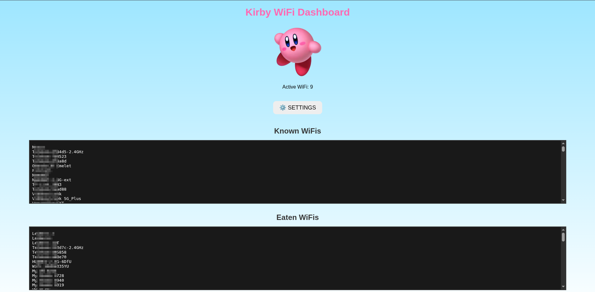

# ദ്ദി(˵ •̀ ᴗ - ˵ ) ✧ Kirby WiFi Dashboard (づ｡◕‿◕｡)づ

  

Kirby WiFi Dashboard is an ESP32-based interactive WiFi scanner and monitor featuring a cute Kirby animation, NeoPixel LED effects, buzzer sounds, and OLED display. It tracks available WiFi networks, logs them to SPIFFS, and "feeds" Kirby with the networks it discovers. The device includes scheduling features, notifications, and a web interface to manage settings and monitor Kirby’s activity.

## Features

### 🌐 WiFi Scanning & Logging
- Continuously scans for WiFi networks (AP+STA mode).  
- Stores discovered WiFis in `wifi.txt` (newly found) and `eat.txt` (already consumed by Kirby).  
- Supports RAM cache and Bloom filter to efficiently track known networks.  
- Automatically removes eaten WiFis from the active list.  

### 🐱 Kirby Pet
- Kirby is “fed” with discovered WiFis every 3 hours.  
- Tracks Kirby’s age and total WiFis eaten.  
- Animated Kirby sprite on the OLED display.  

### 🖥️ OLED Display
- Shows Kirby animation, current age, fridge (WiFis ready to feed), total WiFis, and active WiFi count.  
- Displays top notifications (new WiFis or Kirby eating events).  
- Supports sleep mode to save power.  

### 🌈 NeoPixel LED Effects
- Rainbow fade effect with adjustable hue and brightness.  
- Can be scheduled to turn on/off.  

### 🔔 Buzzer Sounds
- Plays Mario coin sound when Kirby eats a WiFi.  
- Mute function available and can be scheduled.  

### ⏱️ Scheduler
- Control display sleep/wake times.  
- Schedule sound mute/unmute.  
- Schedule WiFi scan on/off.  
- Schedule LED on/off.  
- Schedule deep sleep for power saving.  

### 🌐 Web Interface
- Full dashboard accessible via browser.  
- Shows known and eaten WiFis.  
- Buttons to toggle Sleep, Mute, LED, Scan.  
- Scheduler settings can be updated directly from the web page.  
- Displays Kirby logo and cute UI.  

## 🛠️ Hardware Requirements
- ESP32-C3 (tested)  
- SSD1306 OLED Display (128x64)  
- NeoPixel / WS2812 LED strip (included in the ESP)
- Buzzer  
- Optional: Real-Time Clock (DS3231) for accurate scheduling

## ⚡ Installation
1. Flash the firmware to your ESP32 using Arduino IDE..
2. Connect the OLED, NeoPixel, and buzzer according to the pin definitions in the code.  
3. Place `wifi.txt` and `eat.txt` in SPIFFS or let the firmware create them automatically.  
4. Power up the ESP32. Kirby will animate on the OLED and start scanning WiFis.  
5. Access the web dashboard via the AP IP to manage settings.  

## 🚀 Usage
- Kirby automatically scans for WiFis and logs them.  
- The OLED display shows Kirby’s animation, age, and WiFi stats.  
- LEDs display a smooth rainbow fade (can be disabled).  
- Buzzer plays a sound when Kirby eats a WiFi (can be muted).  
- Scheduler manages screen, sound, scan, LED, and deep sleep times.  

## 📝 Notes
- Uses SPIFFS to store `wifi.txt` and `eat.txt`.  
- Bloom filter used for efficient duplicate checking of WiFi networks.  
- Kirby feeding is automatically based on 3-hour intervals from birthday time.  
- Supports web-based toggles and scheduler settings.
- If you want to use the maximum 4 Mb partition for your ESP, copy board.txt under /packages/esp32/hardware/esp32/version/ folder, and the no_ota_bigger.csv file under /packages/esp32/hardware/esp32/version/tools/partitions/ folder
